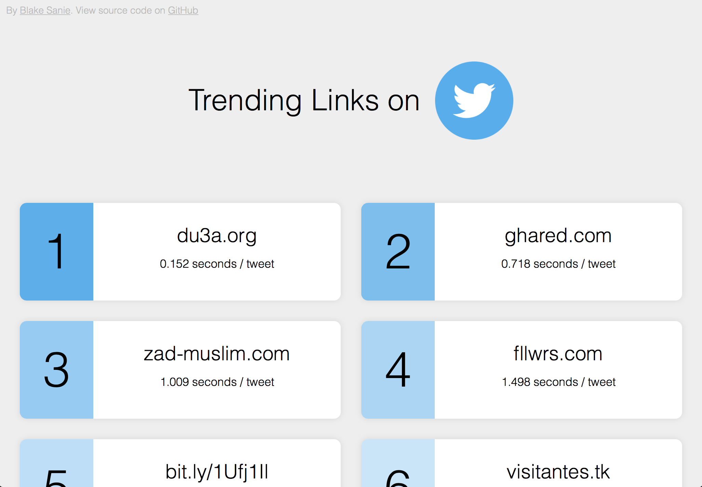

# Trending Links on Twitter
Purpose: to find, track, and display popular links being tweeted.

## How it Works
* ### Backend (Node.js, Express)
The program listens to the twitter's stream of incoming tweets, and identifies those that include a URL. That URL is added to a list of URL objects, where the time elpased since added to the index and frequence of tweets are tracked. Every 15 minutes, the program iterates through all URl objects, and uses (time_elpased / frequency) to determine popularity. Using an API, the tweets with populatity levels above a set threschold are return via a GET request to the frontend.
* ### Frontend(HTML, CSS, JS, jQuery)
The client-side JS makes a GET request to the API, recieving URL objects in the JSON format. The JSON is parsed, sorted, and then translated into HTML elements appended to the webpage for user interaction. 

## Demo

## Additional Links
* Twitter Developers - https://developer.twitter.com
* Express - https://expressjs.com
